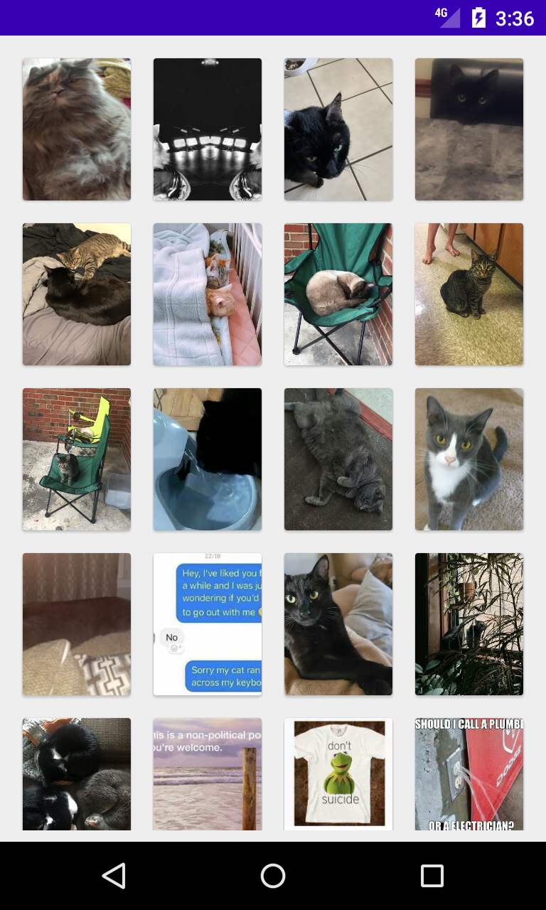
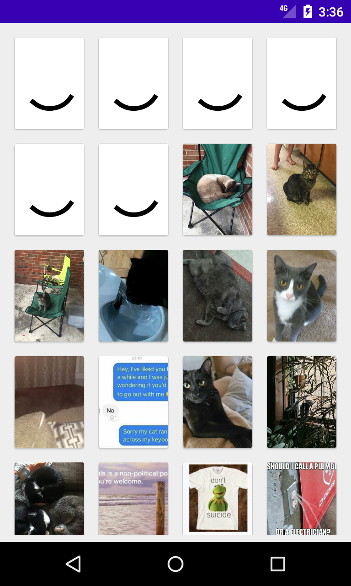
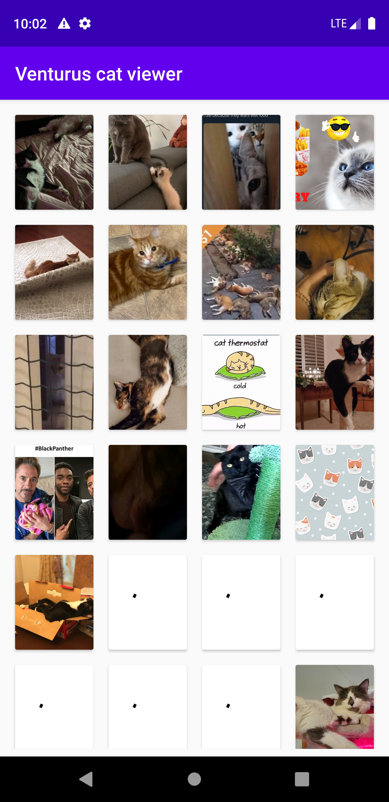

# Venturus Cat Viewer

A simple Android app that make a fetch in imgur (cats section) api and show the images in gallery.

### Tradução
Um aplicativo android simples que faz uma busca na api do imgur (seção de gatos) e exibe as imagens retornadas em uma galeria.

## Table of Contents
1. [Getting Started](#gettingStarted)
2. [Pre-requisites](#preRequisites)
3. [Dependencies and Libraries](#dependenciesLibraries)
4. [App prints](#appPrints)
5. [Author](#author)

## Getting Started
  - Clone this repository.
  - Open in your IDE.
  - Wait gradle sync.
  - Be happy \o/.

### Pre-requisites
  - Android sdk installed.
  - Android tools installed.
  - An real/virtual device to run the app.

### Dependencies and Libraries
  - Dagger    [2.28]    => current
  - Swiper    [1.0.0]   => current
  - Glide     [4.11.0]  => current
  - Retrofit  [2.9.0]   => current
  - Lifecycle [2.2.0]   => current
  - RxJava    [3.0.0]   => current

### App prints
  
  
  
  

## Author
  - [Gabriel Neri](https://br.linkedin.com/in/nerigabriel)

## License
   - This project is licensed under the MIT License - see the [LICENSE.md](LICENSE.md) file for details  
